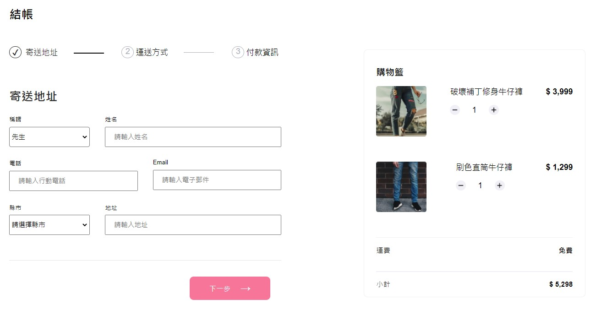
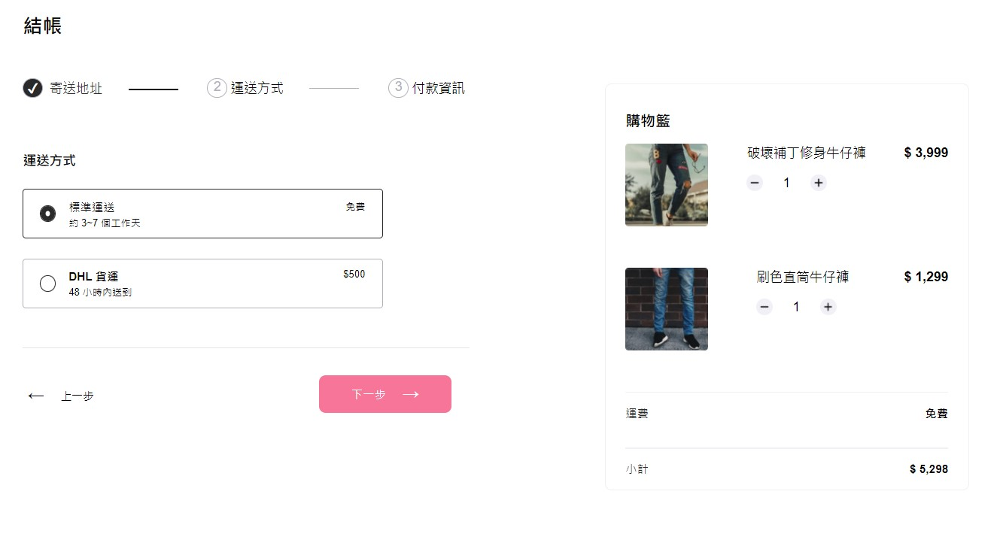

# alpha-shop-vue
---
## 專案桌機版畫面

#### 寄送地址頁面

#### 運送方式頁面

#### 付款資訊頁面


---

## 專案介紹
此專案為Alpha Camp學期三A14 AlphaShop購物車 Vue.js版本，為前一版純手刻的進化版本，主要以Vue搭配Scss開發完成，將頁面細分為Components元件及Views畫面；此次作業的指定規格為完成「結帳區」及「購物車功能」。

---

## 功能描述
1. 一共有三個階段：寄送地址、運送方式和付款資訊。
2. 使用者點擊「下一步」按鈕時，頁面不應被重新整理。使用者在結帳區選擇 DHL 貨運時，運費能夠被反應到購物車中。
3. 使用者能夠調整商品數量，且價格能即時反應到「小計」

---

## 開發工具 
1. Vue.js
2. Scss
3. Java Script

---
## 專案安裝與執行步驟 Project setup
1. 打開終端機並Clone此專案到本地電腦。
```bash 
git clone https://github.com/jj280385/Alpha-Shop-Vue.git
```

2. 使用終端機進入此專案資料夾：alpha_shop。
```bash 
cd Alpha-Shop-Vue
```

3. 使用終端機安裝npm。
```bash 
npm install
```
4. 使用終端機安裝Vue CLI。
```bash 
npm install -g @vue/cli
```

5. 安裝完成後可以輸入以下指令確認是否安裝成功Vue CLI。
```bash 
vue --version
```

6. 使用終端機輸入下列指令啟動專案。 Compiles and hot-reloads for development。
```bash
npm run serve
```

7. 完成開發後打開終端機輸入下列指定打包專案。
Compiles and minifies for production。
```bash
npm run build
```

8. 可輸入下列指令啟動Eslint修復錯誤及報錯。
Lints and fixes files。
```bash
npm run lint
```
---

## 專案開發人員
[ZORA CHEN](https://medium.com/@jj280385)

---
### Customize configuration
See [Configuration Reference](https://cli.vuejs.org/config/).
